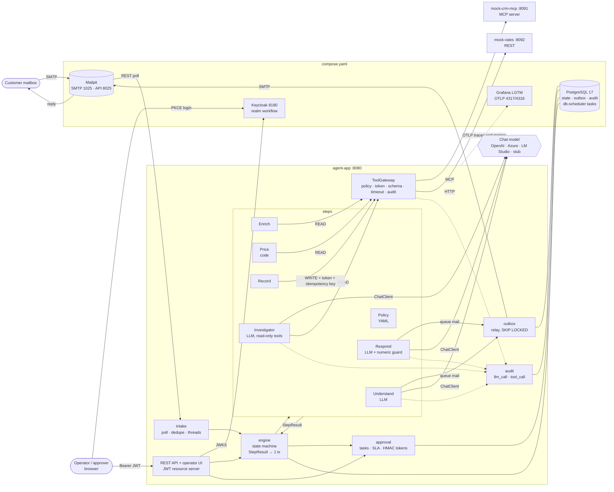
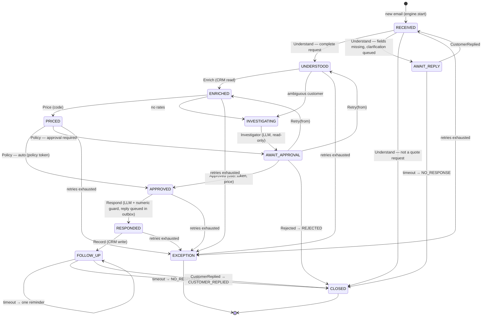

# Architecture

How the parts fit together, how a step runs, and the state machine. The reasons behind the main choices are in
the [ADRs](adr/README.md).

## Components



Reading the arrows:

- Only **engine** changes instance state, in one transaction per step result.
- External systems are reached only through `ToolGateway`; the one **write** (the CRM opportunity) carries an
  approval token and an idempotency key. Mail leaves through the outbox.
- A model is reached only from the LLM steps; only the Investigator gets tools, read-only and on a budget.

## Step execution

```mermaid
sequenceDiagram
    autonumber
    participant S as db-scheduler
    participant E as WorkflowEngine
    participant DB as PostgreSQL
    participant St as Step
    participant G as ToolGateway / ChatClient
    participant R as Outbox relay

    S->>E: advance(instanceId)
    E->>DB: tx: read instance · step_execution RUNNING (attempt n)
    E->>St: execute(context) — no transaction open
    St->>G: model call / tool call (audited)
    G-->>St: result
    St->>DB: queue mail (outbox, key instanceId:kind, insert-if-absent)
    St-->>E: StepResult: Next · Wait · Fail
    E->>DB: tx: check version · new state and context · step_execution SUCCEEDED/FAILED<br/>· timer or retry task
    Note over E,DB: crash before the commit → the state is unchanged and the step runs again;<br/>its mail row and CRM write are keyed, so they happen once
    R->>DB: claim due rows (FOR UPDATE SKIP LOCKED)
    R->>R: send over SMTP with a stable Message-ID
    R->>DB: SENT · or retry later · or FAILED after max attempts
```

## State machine

The state means **which step runs next** (or what the instance is waiting for). It is the `QuoteState`
enum in `agent-app/.../quote/QuoteState.java`; the transitions below are what `WorkflowEngine` applies
from `StepResult` and `Signal` (`engine/`).



Waiting states are `AWAIT_REPLY`, `AWAIT_APPROVAL` and `FOLLOW_UP`; terminal states are `CLOSED` (with
a `closeReason`) and `EXCEPTION`. A step failure is retried by the engine (exponential backoff,
`workflow.engine.max-attempts`, three by default) before the instance lands in `EXCEPTION`. A request the
workflow cannot price (ambiguous customer, no rates for the lane) goes to `INVESTIGATING` instead: the
Investigator writes notes and a person decides.

Signals:

| State | Signal | Next state | Context change |
|---|---|---|---|
| `AWAIT_REPLY` | `CustomerReplied` | `RECEIVED` | reply appended to `replies` |
| `AWAIT_APPROVAL` | `Approved` | `APPROVED` | `approvalToken` set, quote carries the approver's price |
| `AWAIT_APPROVAL` | `Rejected` | `CLOSED` | `closeReason = REJECTED` |
| `AWAIT_APPROVAL` | `Retry(from)` | `UNDERSTOOD` or `ENRICHED` | `error` and `investigation` cleared |
| `FOLLOW_UP` | `CustomerReplied` | `CLOSED` | `closeReason = CUSTOMER_REPLIED` |
