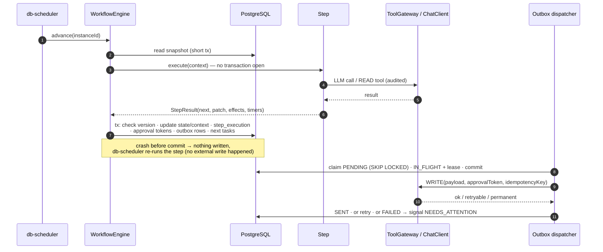
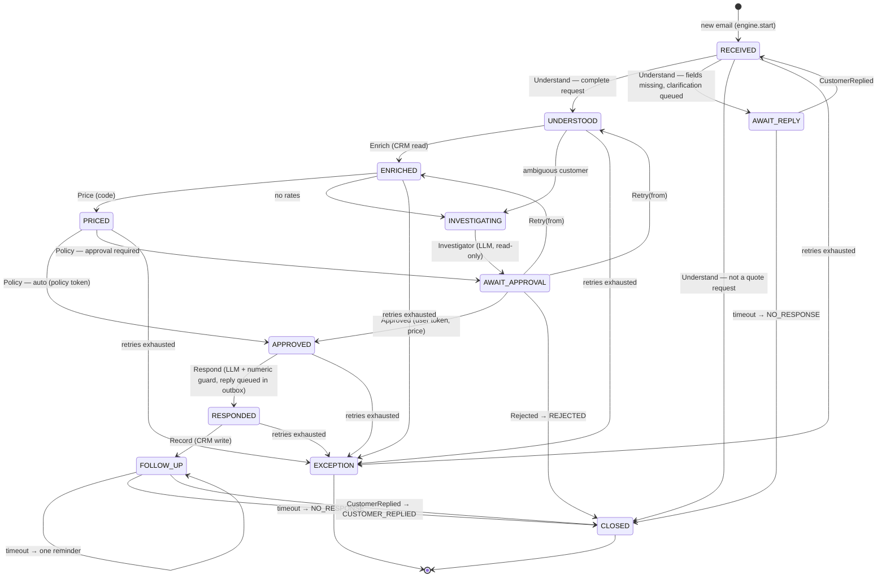

# Architecture

Diagrams for [GUIDE_RU.md §3–4](GUIDE_RU.md#3-архитектура). The state machine below follows the code
(`QuoteState`, `StepResult`, `Signal`); GUIDE_RU.md §4.1–4.2 still lists the earlier state names, see its
[§4.0](GUIDE_RU.md#40-актуальная-машина-состояний).

## Components

Reading the arrows:

- Only **engine** changes instance state, and it does so in one transaction per step result.
- Steps **read** through `ToolGateway`; every **write** leaves as an outbox row and passes the gateway
  with an approval token and an idempotency key.
- The model is reached only from the three LLM steps and never gets tools.

## Step execution

## State machine

The state means **which step runs next** (or what the instance is waiting for). It is the `QuoteState`
enum in `agent-app/.../quote/QuoteState.java`; the transitions below are what `WorkflowEngine` applies
from `StepResult` and `Signal` (`engine/`).

Waiting states are `AWAIT_REPLY`, `AWAIT_APPROVAL` and `FOLLOW_UP`; terminal states are `CLOSED` (with
a `closeReason`) and `EXCEPTION`. A step failure is retried by the engine (`2^attempt` seconds, three
attempts) before the instance lands in `EXCEPTION`.

Signal table (implemented in M1, T1.5):

| State | Signal | Next state | Context change |
|---|---|---|---|
| `AWAIT_REPLY` | `CustomerReplied` | `RECEIVED` | reply appended to `replies` |
| `AWAIT_APPROVAL` | `Approved` | `APPROVED` | `approvalToken` set, quote carries the approver's price |
| `AWAIT_APPROVAL` | `Rejected` | `CLOSED` | `closeReason = REJECTED` |
| `AWAIT_APPROVAL` | `Retry(from)` | `UNDERSTOOD` or `ENRICHED` | `error` and `investigation` cleared |
| `FOLLOW_UP` | `CustomerReplied` | `CLOSED` | `closeReason = CUSTOMER_REPLIED` |
