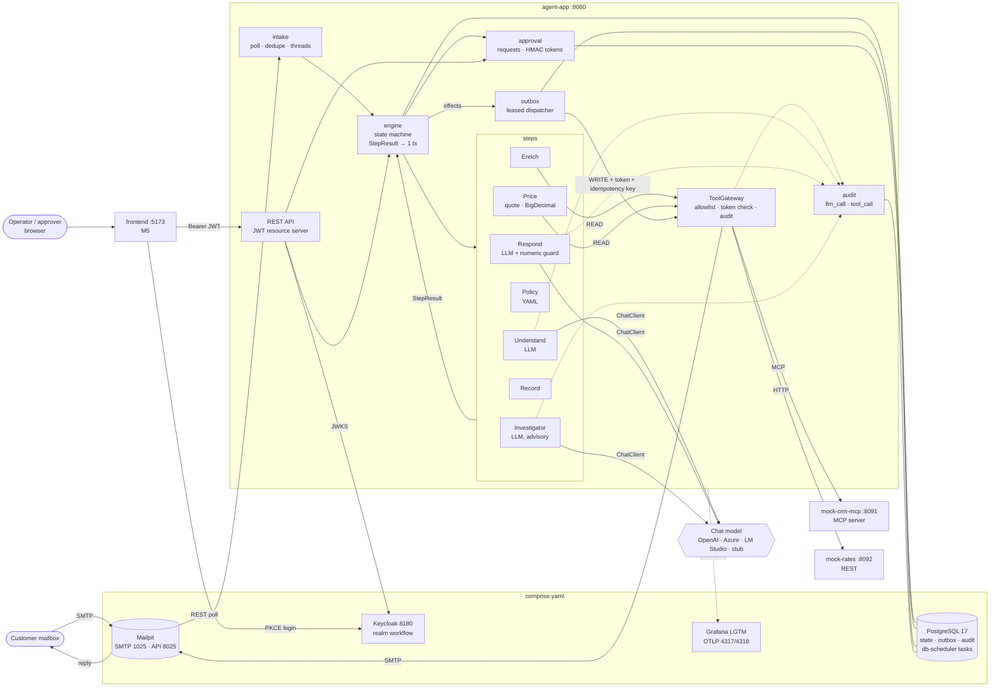
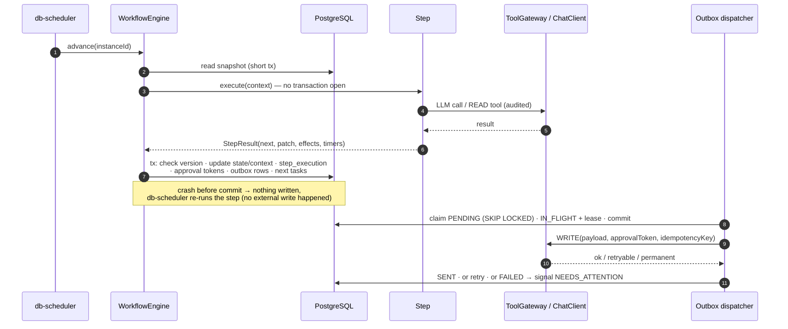
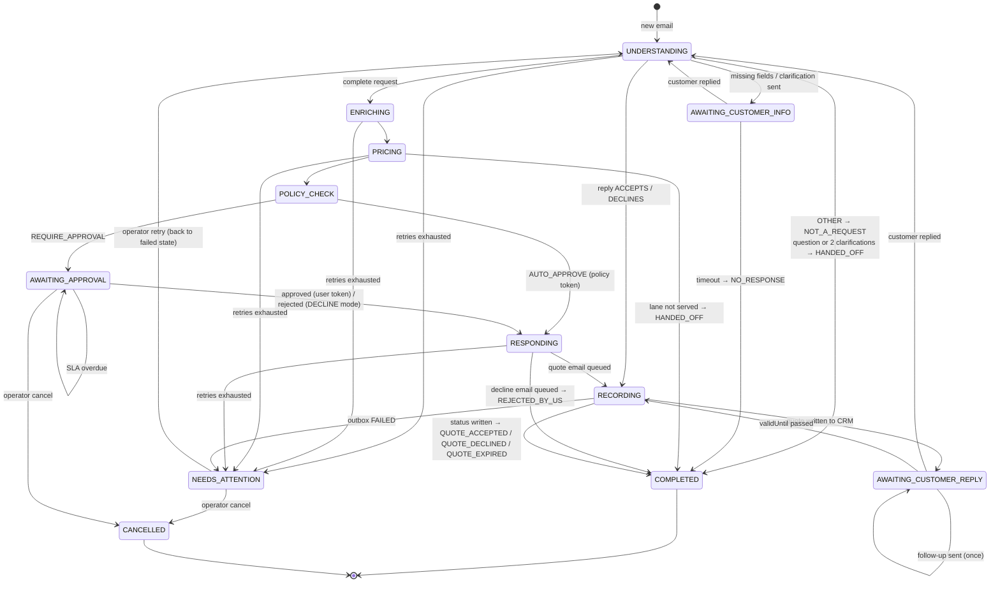

# Architecture

Diagrams for [GUIDE_RU.md §3–4](GUIDE_RU.md#3-архитектура). The guide is authoritative; if a diagram
disagrees with it, fix the diagram.

## Components

Reading the arrows:

- Only **engine** changes instance state, and it does so in one transaction per step result.
- Steps **read** through `ToolGateway`; every **write** leaves as an outbox row and passes the gateway
  with an approval token and an idempotency key.
- The model is reached only from the three LLM steps and never gets tools.

## Step execution

## State machine

`NEEDS_ATTENTION → retry` returns to whichever state failed (`failed_state`); the diagram shows one
edge for readability. Cancel is allowed from every non-terminal state.
